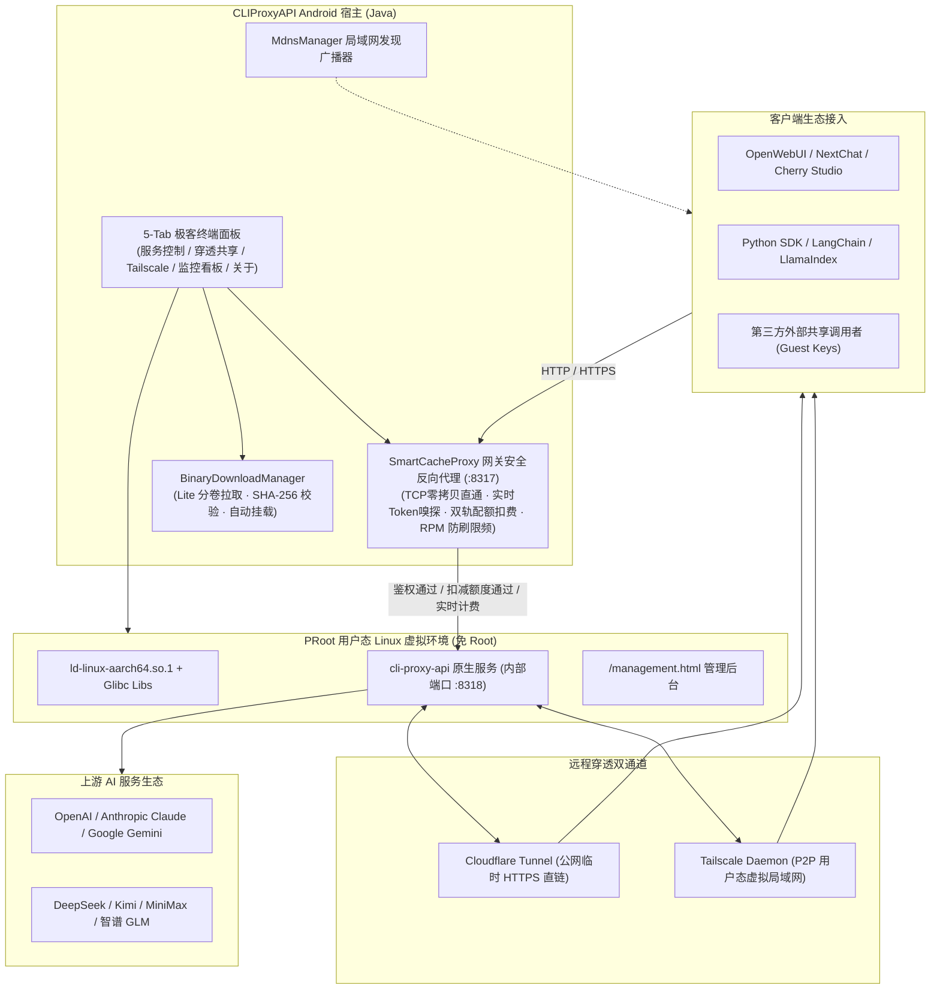

<div align="center">

# 🚀 CLIProxyAPI for Android

**基于 Android PRoot Linux 虚拟化环境的高性能掌上 AI 网关与穿透中心**

[-3DDC84?style=flat-square&logo=android&logoColor=white)](https://developer.android.com)
[-blue?style=flat-square&logo=arm)](https://github.com/liaoyh9422-creator/CLIProxyAPI)
[](https://gitee.com/ishark666/cliproxy-release)
[-orange?style=flat-square)](https://github.com/liaoyh9422-creator/CLIProxyAPI/releases)
[](https://gradle.org)
[](LICENSE)

<p align="center">
  <b>无需 Root 权限</b> · <b>原生 TCP 零拷贝直通</b> · <b>实时 Token 嗅探计量</b> · <b>1.2MB 极简安装包</b> · <b>双通道穿透组网</b> · <b>多 Key 共享与配额流控</b>
</p>

</div>

---

## 📖 项目简介

**CLIProxyAPI for Android** 是专门为 Android 移动平台量身定制的高性能 AI 代理网关客户端。

本项目基于移动端轻量级 **PRoot Linux 用户态虚拟化容器沙箱**，免 Root 权限直接在手机内部运行官方原生静态编译的 [CLIProxyAPI 上游内核](https://github.com/router-for-me/CLIProxyAPI)。它能将各类主流 AI 官方渠道平滑转换为标准的 OpenAI API 接口规范（`/v1/chat/completions`、`/v1/models`、`/v1/responses` 等），并在 Android 宿主层集成了**原生 TCP 零拷贝流式直通**、**多厂商 Token 实时嗅探与估算**、**Cloudflare / Tailscale 双轨远程穿透组网**、**mDNS 局域网自发现**以及**外网共享多 Key 双轨配额扣费与 RPM 防刷限流盾牌**等强大功能。

---

## 🌟 核心特性一览

### 1. ⚡️ 极致轻量双构建体系 (Dual Flavors)
* **Lite 极速轻量版 (仅 1.2 MB)**：安装包精简至极限，仅保留纯 Native 壳工程，底层核心二进制（Glibc 运行时、CLIProxy 内核、Cloudflare、Tailscale）在初次启动时按需从国内镜像高速下载并自动校验部署（SHA-256 分卷合并校验）。
* **Full 离线完整版 (50 MB)**：内置全部运行时库与静态二进制文件，完全离线运行，开箱即用。

### 2. ⚡️ 原生 TCP 零拷贝直通与多厂商 Token 实时嗅探
* **纯原生 TCP 零拷贝直通**：宿主网关与沙箱内核无缝衔接，内存开销极低，流式打字机效果 100% 丝滑无延迟。
* **Keep-Alive 长连接全链路追踪**：完美兼容多轮对话连接复用，原地实时精准捕获 OpenAI、Claude、Gemini、DeepSeek 等大模型官方 Usage 与 Token 统计；当上游未返回 Usage 时，内置多语言 Token 估算器进行精确估算补全。

### 3. 🛡️ 外网共享多 Key 管理与双轨配额控制 (Multi-Key Policy)
* **多租户 Guest 密钥分发**：支持为主机创建专属的外网共享 Key（如 `sk-guest-xxxx`），支持一键脱敏、重置与快速复制。
* **双轨扣费机制**：
  - **按 Token 扣减**：支持 10M / 20M / 50M / 100M 等自定义 Token 额度设定，支持精确流式扣减。
  - **按调用次数扣减**：支持 100 次 / 500 次 / 1000 次等计次扣减，额度耗尽自动拦截并返回 HTTP 403 / 429。
* **动态流控与防刷盾牌**：内置滑动窗口毫秒级 RPM（每分钟请求数）频次限制与单 Key 禁用/解封。

### 4. 🌐 双通道内网穿透与异地组网 (Dual Tunnels)
* **Cloudflare Tunnel 快速穿透**：无需公网 IP 与服务器，一键生成临时公网安全 HTTPS 直连域名。
* **Tailscale 虚拟局域网**：集成原生 `tailscale` 与 `tailscaled`，纯用户态模式（免 Root，不占系统 VPN 槽位），支持自定义 AuthKey 与主机名，跨设备实现点对点私有安全互联。

### 5. 📡 mDNS 局域网自发现 (Zero-Config Discovery)
* 服务启动后可选择开启广播 `_cliproxy._tcp` 局域网服务，同一 Wi-Fi 下的客户端（如 NextChat、Cherry Studio、OpenWebUI）无需手动配置 IP，自动感知在线网关。

### 6. 💻 可视化 5-Tab 极客终端面板与持久化安全存储
* **5 大功能面板**：
  1. **服务主页 (ServiceTab)**：核心服务生命周期启停、本地与局域网端点轮播、主 API Key 与端口安全管理、实时运行日志。
  2. **外网穿透 (TunnelTab)**：Cloudflare 隧道公网域名生成、出站代理设置、外网共享 Guest API 密钥与配额管理。
  3. **Tailscale 组网 (TailscaleTab)**：免 Root 用户态 Tailscale 状态监控、局域网 IP 与 AuthKey 配置。
  4. **监控看板 (MetricsTab)**：核心指标六宫格（今日请求量、失败率、平均延迟、Token 消耗、运行时长）、访问审计与过滤日志。
  5. **关于与系统 (AboutTab)**：软件版本、运行底座、开源仓库与核心上游链接。
* **安全沙箱与平滑迁移**：配置文件及凭据默认保存在应用私有安全沙箱中，并支持从历史外部存储目录（`/sdcard/Download/CLIProxyAPI/`）自动平滑迁移。

### 7. 🌐 全局出站网络代理与即时诊断 (Outbound Proxy)
* **全协议覆盖**：原生支持 `HTTP`、`HTTPS` 与 `SOCKS5` 代理（兼容 Clash `127.0.0.1:7890`、v2rayNG `127.0.0.1:10809` 等）。
* **沙箱环境自动透传**：无须系统开启全局 VPN，代理参数自动注入 PRoot 容器环境变量（`HTTP_PROXY` / `ALL_PROXY`），驱动核心网关与 Cloudflare 穿透隧道建立网络通信。
* **智能分流与一键连通性测试**：内置局域网/国内直连白名单 (`NO_PROXY`)；支持一键测速并即时反馈 Cloudflare 与 OpenAI 节点往返延迟。

---

## 🏗️ 系统架构设计



---

## 🚀 快速上手

### 1. 下载与安装

* 前往 [GitHub Releases](https://github.com/liaoyh9422-creator/CLIProxyAPI/releases) 或国内镜像 [Gitee Release](https://gitee.com/ishark666/cliproxy-release) 获取最新 APK：
  * **日常推荐**：下载 **`app-lite-release.apk` (1.2 MB)**，启动时自动拉取核心组件；
  * **完全离线**：下载 **`app-full-release.apk` (50 MB)**，开箱即用。

### 2. 默认运行参数

| 配置项 | 默认值 | 说明 |
| :--- | :--- | :--- |
| **对外服务端口** | `8317` | 本地回环与局域网接入端口（由 SmartCacheProxy 监听） |
| **沙箱内部端口** | `8318` | PRoot 内部原生 cli-proxy-api 实际监听端口 |
| **API Base URL** | `http://localhost:8317/v1` | 标准 OpenAI 格式兼容接口 |
| **主管理员 API Key** | `sk-cliproxy-default` | 宿主全局默认管理密钥 |
| **Web 管理后台** | `http://localhost:8317/management.html` | 可视化管理控制台 |
| **默认后台密码** | `cliproxy123` | 进入 Web 管理后台凭证 |
| **数据与配置存储** | 私有安全沙箱 / 外部持久化 | 配置文件与 Token 自动持久化并支持旧版本平滑迁移 |

---

### 3. 客户端接入示例

#### cURL 测试
```bash
curl http://localhost:8317/v1/chat/completions \
  -H "Content-Type: application/json" \
  -H "Authorization: Bearer sk-cliproxy-default" \
  -d '{
    "model": "gpt-4o",
    "messages": [{"role": "user", "content": "你好，CLIProxyAPI！"}]
  }'
```

#### Python (OpenAI SDK)
```python
from openai import OpenAI

client = OpenAI(
    base_url="http://127.0.0.1:8317/v1",
    api_key="sk-cliproxy-default"  # 或外网分配的 guest 密钥
)

response = client.chat.completions.create(
    model="gpt-4o",
    messages=[{"role": "user", "content": "写一首赞美开源的十四行诗"}]
)
print(response.choices[0].message.content)
```

#### NextChat / Cherry Studio / OpenWebUI
* **接口地址 (API Endpoint)**：`http://<手机局域网IP>:8317`
* **API 密钥 (API Key)**：`sk-cliproxy-default` 或 `sk-guest-xxxx`

---

## 🛠️ 源码编译与构建

本项目采用标准 Gradle 构建系统，包含完整的签名配置与分 Flavor 构建脚本。

```bash
# 克隆本仓库
git clone https://github.com/liaoyh9422-creator/CLIProxyAPI.git
cd CLIProxyAPI

# 1. 编译 Lite 极速轻量版 (1.2MB)
./gradlew assembleLiteRelease
# 产物位置: app/build/outputs/apk/lite/release/app-lite-release.apk

# 2. 编译 Full 离线完整版 (50MB)
./gradlew assembleFullRelease
# 产物位置: app/build/outputs/apk/full/release/app-full-release.apk

# 3. 编译 Debug 开发版
./gradlew assembleDebug
```

---

## 📂 项目目录结构

```text
CLIProxyAPI/
├── app/                              # Android 宿主应用模块
│   ├── src/
│   │   ├── main/                     # 通用代码与通用轻量资产
│   │   │   ├── assets/               # 基础配置 (config.default.yaml, fullstack_config.json)
│   │   │   ├── java/com/cliproxy/app/
│   │   │   │   ├── config/           # AppConfig 配置与 SharedPreferences 封装
│   │   │   │   ├── tabs/             # 5 大功能 Tab 面板 (Service, Tunnel, Tailscale, Metrics, About)
│   │   │   │   ├── ui/               # UiTheme 极客主题与 WebPanelManager 后台嵌入
│   │   │   │   └── MainActivity.java # 主 Activity 调度与生命周期管理
│   │   │   └── jniLibs/arm64-v8a/    # PRoot 原生引导库 (libproot.so, libloader.so 等)
│   │   ├── full/                     # Full 专用源集 (内置大型二进制包)
│   │   │   ├── assets/               # cloudflared, tailscale, glibc 运行时包
│   │   │   └── jniLibs/arm64-v8a/    # libcliproxy.so 核心内核
│   │   └── lite/                     # Lite 专用源集 (极简，外置按需下载)
│   └── build.gradle                  # 包含 full/lite 多渠道与签名定义
├── core/                             # 核心业务逻辑与沙箱模块
│   └── src/main/java/com/cliproxy/core/
│       ├── cache/                    # SmartCacheProxy 原生 TCP 直通网关与多 Key 配额盾牌
│       ├── download/                 # BinaryDownloadManager 组件按需下载与分卷合并
│       ├── mdns/                     # MdnsManager 局域网服务自发现广播
│       ├── metrics/                  # MetricsTracker 运维指标与 TokenEstimator 估算器
│       ├── proot/                    # ProotManager Linux 虚拟沙箱挂载与进程管理
│       ├── proxy/                    # ProxyTester 出站代理连通性与延迟测试
│       ├── receiver/                 # HeartbeatReceiver 前台保活心跳广播接收器
│       ├── service/                  # ProxyService 核心前台服务与生命周期
│       ├── tailscale/                # TailscaleManager 纯用户态虚拟组网守护
│       ├── tunnel/                   # TunnelManager Cloudflare 穿透管理
│       └── util/                     # ProcessUtil, AssetExtractor 工具类
├── gradlew                           # Gradle Wrapper 脚本
├── build.gradle                      # 根构建脚本
└── settings.gradle                   # 模块注册配置
```

---

## 🔒 免责声明与许可协议

* 本项目仅供技术研究与个人学习使用，请遵守当地相关法律法规及上游服务商的服务条款。
* 核心上游代理内核遵循其对应开源许可，本项目 Android 客户端基于 [MIT 协议](LICENSE) 开源。
